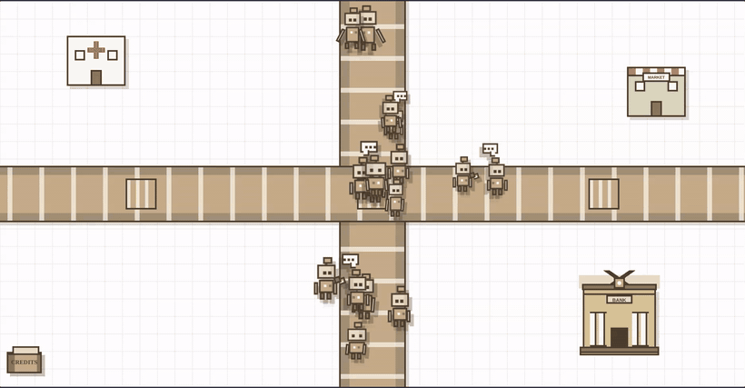

  

 

  
   
  <strong>build tape:</strong> web apps, backend systems, automation workflows, and AI-powered projects

 

  
  

<table align="center">
  <tr>
    <td align="center"><strong>Shipping</strong> real projects, fast iteration</td>
    <td align="center"><strong>Learning</strong> systems, scale, product thinking</td>
    <td align="center"><strong>Collaborating</strong> open source, hackathons, startups</td>
  </tr>
</table>

###

  
  
  
  
  
  
  
  
  
  
  
  
  
  
  
  
  
  
  
  
  
  
  
  
  
  
  
  
  
  
  
  
  
  
  
  
  
  
  
  
  
  
  
  
  
  
  
  
  
  
  
  
  
  
  
  
  

###

  
  
  
  
  

###

  
   
  

###

<picture>
  <source media="(prefers-color-scheme: dark)" srcset="https://raw.githubusercontent.com/MONSTER13LIAR/MONSTER13LIAR/output/pacman-contribution-graph-dark.svg">
  <source media="(prefers-color-scheme: light)" srcset="https://raw.githubusercontent.com/MONSTER13LIAR/MONSTER13LIAR/output/pacman-contribution-graph.svg">
  
</picture>

###
