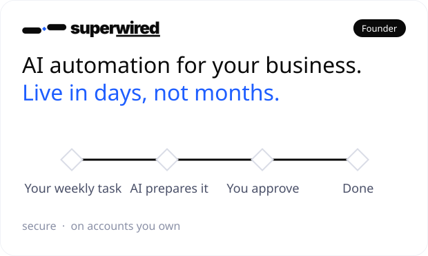

<a href="https://monster13liar.xyz">
  <picture>
    <source media="(prefers-color-scheme: dark)" srcset="./assets/readme/hero-dark.svg">
    <source media="(prefers-color-scheme: light)" srcset="./assets/readme/hero-light.svg">
    
  </picture>
</a>

  <a href="https://monster13liar.xyz"><b>Portfolio</b></a> &nbsp;·&nbsp;
  <a href="https://x.com/MONSTER13LIAR"><b>X</b></a> &nbsp;·&nbsp;
  <a href="https://mcpatch-nine.vercel.app"><b>MCPatch</b></a> &nbsp;·&nbsp;
  <a href="https://superwired.vercel.app"><b>Superwired</b></a> &nbsp;·&nbsp;
  <a href="mailto:monster13liar@gmail.com"><b>Email</b></a>

### Building now

  
  

**MCPatch** replays the connection to your MCP server the way Claude does, names the step that breaks, and writes the fix.
**Superwired** is my AI agency: we set up an AI workflow for a business from start to finish, on accounts the business owns.

<picture>
  <source media="(prefers-color-scheme: dark)" srcset="./assets/readme/stats-dark.svg">
  <source media="(prefers-color-scheme: light)" srcset="./assets/readme/stats-light.svg">
  
</picture>

### Worth opening

| | What it does | |
|---|---|---|
| **[Drillmap](https://github.com/MONSTER13LIAR/drillmap)** | Evacuation maps and timed mock drills for schools | [Live](https://drillmap.vercel.app) |
| **[Asli Kamai](https://github.com/MONSTER13LIAR/Asli-Kamai)** | Shows delivery riders what they really kept after petrol, EMI and recharge. English and Hindi | [Live](https://asli-kamai.vercel.app) |
| **[Aravalli Watch](https://github.com/MONSTER13LIAR/aravalli-watch)** | Satellite imagery of the Aravalli hills, year by year, with a complaint draft for what changed | [Live](https://aravalli-watch.vercel.app) |
| **[EARTH](https://github.com/MONSTER13LIAR/EARTH)** | A voice-first companion for rural Indian families. 1st place, GIC 2030 AI Challenge | [Live](https://earth-sepia-seven.vercel.app) |

<a href="https://monster13liar.xyz">
  <picture>
    <source media="(prefers-color-scheme: dark)" srcset="./assets/readme/timeline-dark.svg">
    <source media="(prefers-color-scheme: light)" srcset="./assets/readme/timeline-light.svg">
    
  </picture>
</a>

### Creation of Adam

I'm turning what I build into a business, in public. **Day N of chasing my goals**, every day on [X](https://x.com/MONSTER13LIAR).

<picture>
  <source media="(prefers-color-scheme: dark)" srcset="https://raw.githubusercontent.com/MONSTER13LIAR/MONSTER13LIAR/snake/snake-dark.svg">
  <source media="(prefers-color-scheme: light)" srcset="https://raw.githubusercontent.com/MONSTER13LIAR/MONSTER13LIAR/snake/snake-light.svg">
  
</picture>

TypeScript · React · Node · Python · Postgres · Vercel

